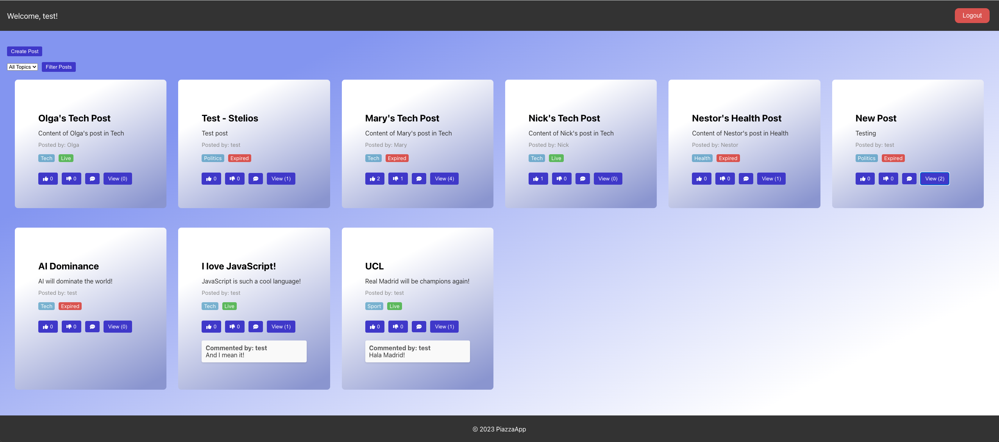

# Piazza Frontend

## Project Description

The Piazza frontend, developed using React, offers a user-friendly interface designed to interact seamlessly with the Piazza backend, forming an integral part of our full-stack application. This interface provides a dynamic and responsive user experience, enabling users to engage with the Piazza platform by posting messages, commenting, and reacting to content. Developed as part of the Cloud Computing Concepts assignment at Birkbeck University, this frontend complements our backend services, which are detailed in a separate repository: [https://github.com/cgoncalves94/piazza-backend].

## Key Features

- **User Authentication:** Secure login system with session management.
- **Dynamic Post Creation:** Users can create posts with topics and set expiration times.
- **Interactive Post Grid:** A responsive grid that displays posts with options to like, dislike, create comments and view them.
- **Real-time Updates:** The interface updates posts and interactions in real-time.

## Technologies and Libraries

- **React:** A JavaScript library for building user interfaces.
- **Axios:** Promise based HTTP client for the browser and node.js.

## Screenshots

*Grid layout displaying posts with interaction options.*

## Credits

Developed by Cesar Goncalves for the Cloud Computing Concepts module at BSc Computer Science, Birkbeck University.
